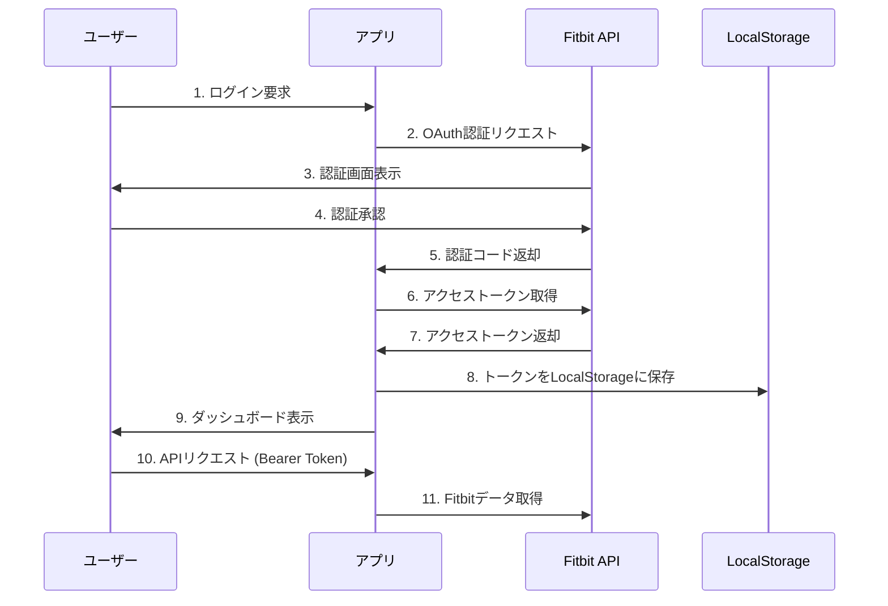

# 🏃‍♂️ Fitbit データ連携アプリ

Fitbit Web APIを使用してヘルスデータを取得・可視化するWebアプリケーション

## 🎯 **機能概要**

- **🔐 安全な認証** - OAuth 2.0 + Bearer Token認証
- **📊 ヘルスデータ可視化** - 歩数、心拍数、睡眠データの表示
- **⚡ リアルタイム更新** - 5分間隔での自動データ更新
- **☁️ クラウド対応** - Vercelサーバーレス環境で動作
- **📱 レスポンシブ対応** - PC・スマートフォン両対応

## 📊 **対応データ**

| データ種別 | 説明 | API エンドポイント |
|------------|------|-------------------|
| 🚶 歩数 | 日次歩数データ | `/activities/steps` |
| ❤️ 心拍数 | 心拍数ゾーン | `/activities/heart` |
| 😴 睡眠 | 睡眠時間・質 | `/sleep` |
| 🔥 カロリー | 消費カロリー | `/activities/calories` |
| 📏 距離 | 移動距離 | `/activities/distance` |

## 🚀 **セットアップ**

### 1. 依存関係のインストール
```bash
npm install
```

### 2. Fitbitアプリ設定
1. [Fitbit Developer Console](https://dev.fitbit.com/apps) でアプリを登録
2. アプリケーションタイプ: **Server**
3. `Client ID` と `Client Secret` を取得
4. **重要**: リダイレクトURIを正確に設定
   - 開発環境: `http://localhost:3000/auth/callback`
   - 本番環境: `https://your-app-name.vercel.app/auth/callback`

### 3. 環境変数設定
```bash
cp .env.example .env
```

`.env` ファイルを編集：
```env
FITBIT_CLIENT_ID=your-client-id
FITBIT_CLIENT_SECRET=your-client-secret
FITBIT_REDIRECT_URL=http://localhost:3000/auth/callback
SESSION_SECRET=your-secure-session-secret
PORT=3000
NODE_ENV=development
```

⚠️ **セキュリティ注意**: `.env` ファイルはGitに含めないでください

### 4. サーバー起動
```bash
# 開発環境
npm run dev

# 本番環境
npm start
```

アプリケーションが `http://localhost:3000` で起動します。

## 🎯 **使用方法**

1. **アプリにアクセス** - ブラウザでアプリのURLを開く
2. **「Fitbitと連携する」ボタンをクリック** - Fitbit認証画面に自動遷移
3. **Fitbitアカウントでログイン** - 認証を許可
4. **ダッシュボードでデータ確認** - 自動的にダッシュボードに移動しデータ表示

## 🌐 **Vercelデプロイ**

### 1. Vercelアカウント設定
1. [Vercel](https://vercel.com) でアカウント作成
2. GitHubアカウントと連携

### 2. プロジェクトデプロイ
```bash
# Vercel CLIをインストール（オプション）
npm install -g vercel

# Vercelダッシュボードから直接GitHubリポジトリをインポート
# または、CLIを使用：
vercel --prod
```

### 3. 環境変数設定
Vercelダッシュボードの「Settings > Environment Variables」で以下を設定：

```env
FITBIT_CLIENT_ID=your-fitbit-client-id
FITBIT_CLIENT_SECRET=your-fitbit-client-secret
FITBIT_REDIRECT_URI=https://your-app-name.vercel.app/auth/callback
SESSION_SECRET=your-super-secret-session-key
NODE_ENV=production
```

**注意**: 環境変数の設定は必須です。

### 4. Fitbitアプリ設定更新
Fitbit Developer Consoleで：
1. リダイレクトURIに `https://your-app-name.vercel.app/auth/callback` を追加
2. 本番用ドメインを許可リストに追加

### 5. デプロイ確認
- `https://your-app-name.vercel.app` にアクセス
- Fitbit認証とデータ取得をテスト

## 📁 **プロジェクト構造**

```
fitbit-data-connector/
├── src/
│   ├── server.js           # Express サーバー
│   ├── routes/
│   │   ├── auth.js         # OAuth認証ルート
│   │   └── api.js          # Fitbit API ルート
│   ├── services/
│   │   └── fitbitClient.js # Fitbit API クライアント
│   └── utils/
│       └── helpers.js      # ユーティリティ関数
├── public/
│   ├── index.html          # メインページ
│   ├── dashboard.html      # ダッシュボード
│   ├── css/
│   │   └── style.css       # スタイルシート
│   └── js/
│       └── app.js          # フロントエンド JS
├── config/
│   └── fitbit.js           # Fitbit設定
└── docs/
    └── api.md              # API ドキュメント
```

## 🏗️ **アーキテクチャ**

### 認証フロー


### 技術スタック
- **フロントエンド**: Vanilla JavaScript + Chart.js
- **バックエンド**: Node.js + Express.js
- **認証**: OAuth 2.0 + Bearer Token
- **ストレージ**: LocalStorage (クライアント)
- **デプロイ**: Vercel (サーバーレス)

## 🔧 **開発ガイド**

### APIエンドポイント
```javascript
// 認証関連
GET  /auth/login     // OAuth認証開始
GET  /auth/callback  // OAuth認証コールバック
POST /auth/logout    // ログアウト

// データ取得関連
GET  /api/profile           // ユーザープロフィール
GET  /api/activity/today    // 今日の活動データ
GET  /api/heartrate         // 心拍数データ
GET  /api/sleep             // 睡眠データ
GET  /api/devices           // デバイス情報

// システム関連
GET  /health               // ヘルスチェック
GET  /debug/env           // 環境変数確認 (開発環境のみ)
```

### 新しいデータタイプの追加手順
1. **サーバーサイド**: `src/services/fitbitClient.js` にメソッド追加
2. **APIルート**: `src/routes/api.js` にエンドポイント追加
3. **フロントエンド**: `public/js/dashboard.js` にデータ表示処理追加

## 🔐 **セキュリティ**

- **OAuth 2.0認証** - Fitbit公式認証フロー
- **Bearer Token** - セッションレスなトークンベース認証
- **CORS設定** - オリジン制限による不正アクセス防止
- **環境変数管理** - 機密情報の安全な管理
- **XSS保護** - サニタイズされたデータ表示

## 📈 **ロードマップ**

### 🚀 短期改善
- [ ] エラーハンドリングの強化
- [ ] ユーザビリティの改善
- [ ] パフォーマンス最適化

### 🎯 中期機能追加
- [ ] データベース連携（MongoDB/PostgreSQL）
- [ ] データエクスポート機能（CSV/JSON）
- [ ] 詳細な統計・分析機能
- [ ] 複数デバイス対応

### 🌟 長期ビジョン
- [ ] リアルタイム通知システム
- [ ] カスタムダッシュボード機能
- [ ] モバイルアプリ開発
- [ ] 他のヘルスケアAPI連携

## 🤝 **コントリビューション**

1. このリポジトリをフォーク
2. フィーチャーブランチを作成 (`git checkout -b feature/amazing-feature`)
3. 変更をコミット (`git commit -m 'Add amazing feature'`)
4. ブランチをプッシュ (`git push origin feature/amazing-feature`)
5. プルリクエストを作成

## 📄 **ライセンス**

MIT License - 詳細は [LICENSE](LICENSE) ファイルを参照

## 🔗 **参考リンク**

- [Fitbit Web API Documentation](https://dev.fitbit.com/build/reference/web-api/)
- [OAuth 2.0 Authorization Framework](https://tools.ietf.org/html/rfc6749)
- [Express.js Documentation](https://expressjs.com/)